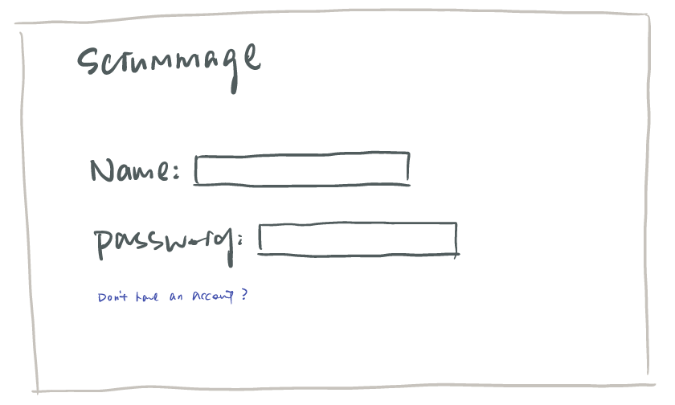
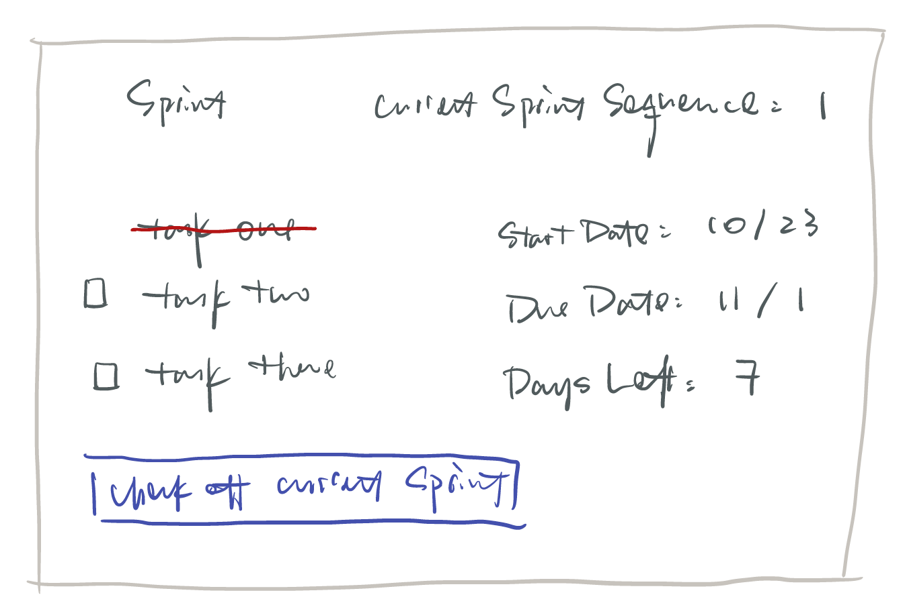

The content below is an example project proposal / requirements document. Replace the text below the lines marked "__TODO__" with details specific to your project. Remove the "TODO" lines.

# Scrummage

## Overview

Do you sometimes feel like product developing is such a biggg mass that everything just mess up together? Have you ever tired to make some changes by adopting some agile  methodology such as *scrum development* but eventually gave up halfway because of lack of proper management tools?  Well, I have. Procrastination is my middle name and I really need something to push and track my work. Soooo ... that's where Scrummage comes in! 

Scrummage is a web app that will allow users to have their own backlog and each sprint managed in a proper manner. Users can register and login; once they're logged in, they can create or view their backlog containing all the user stories that need to be develped (not recommended to have too many backlog at the same time tho). For every backlog, users can pick any of them to the current sprint; each time user finished a task, it will be cross off from both the current sprint and the backlog; by the end of each sprint, user could choose to place the unfinished tasks back to the backlog. 

## Data Model

(___TODO__: a description of your application's data and their relationships to each other_) 

The application will store Users, current_sprint and backlog

* users can have at most three list (via references)
* each list can have at most 100 items (by embedding)

(___TODO__: sample documents_)

An Example User:

```javascript
{
  username: "Major Tom",
  hash: // a password hash,
  current_sprints:[Sprint] // an array containing all current sprints
  backlog: [Backlog]// the backlog that this user joined
}
```

An Example sprint:

```javascript
{
  name: "sprint1",
  dueday:  //timestamp
  tasks: //[task1, task2, ... ],
  // currentTask: items[0],
  createdAt: // timestamp
  finished: ture,
  backlog: bakclog // from which the sprint is picked 
}
```

An Example backlog:

```javascript
{
  developers:[User] // a reference to an array of User objects
  product_name: "app",
  tasks: //[task1, task2, ... ],
  // currentTask: items[0],
  finished: ture,
}
```
An Example taks:

```javascript
{
  name: "create the login page",
  finished: false,
  developer: User, // the user object of the developer to whom this task is assigned
}
```


## [Link to Commented First Draft Schema](db.js) 


## Wireframes

see also under documentation folder



/list - page for showing all shopping lists


/list/slug - page for showing specific shopping list



## Site map

see under documentation folder


## User Stories or Use Cases

1. as non-registered user, I can register a new account with the site
2. as a user, I can log in to my own scrum master
3. as a user, I can create a new backlog for all product features
4. as a user, I can view all of the tasks I've created in a single backlog
5. as a user, I can add task to an existing backlog
6. as a user, I can pick tasks from backlog to current sprint
7. as a user, I can cross off tasks that is finished in current sprint
8. as a user, I can put tasks back to backlog if it was left unfinished by the end of current sprint
9. as a user, I can delete tasks from backlog and sprint 

## Research Topics

* (3 points) Unit testing with JavaScript
    
* (2 points) Use a CSS framework throughout your site, use a reasonable of customization of the framework 
   
* (3 points) external API used
    

10 points total out of 8 required points 


## [Link to Initial Main Project File](app.js) 


## Annotations / References Used


